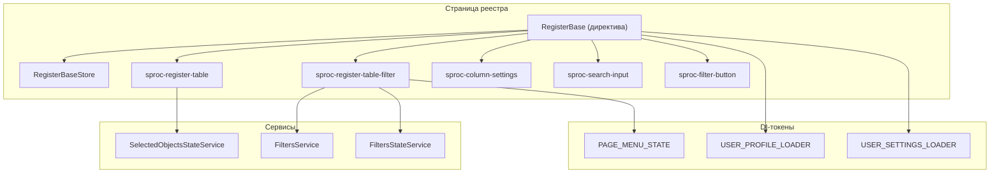

# Каталог `ngx-register-base`

Библиотека UI-компонентов для построения **реестров** (таблиц с фильтрами, пагинацией, настройкой колонок и выбором строк) в Angular-приложениях. Построена на **Taiga UI 4.48**, **Apollo/GraphQL (Hasura)** и **NgRx ComponentStore**.

| Параметр | Значение |
|---|---|
| Пакет | `ngx-register-base` |
| Версия | `2.0.0` |
| Точка входа | `src/public-api.ts` |
| Angular (peer) | `^18.2.0` |
| Префикс селекторов | `sproc-` |

> В `package.json` указаны peer-зависимости Angular 18.2. При миграции на Angular 19 проверьте совместимость Taiga UI и Apollo.

---

## Содержание

1. [Быстрый старт](#быстрый-старт)
2. [Структура каталога](#структура-каталога)
3. [Компоненты](#компоненты)
4. [Директивы](#директивы)
5. [Сервисы](#сервисы)
6. [Ядро (core)](#ядро-core)
7. [Типы и токены](#типы-и-токены)
8. [Store и утилиты](#store-и-утилиты)
9. [Стили и иконки](#стили-и-иконки)
10. [Схематики](#схематики)

---

## Быстрый старт

### Установка peer-зависимостей

```bash
npm install @angular/cdk @angular/common @angular/core \
  @taiga-ui/core @taiga-ui/kit @taiga-ui/addon-table @taiga-ui/legacy \
  @ngrx/component-store apollo-angular @apollo/client graphql \
  date-fns lodash moment-timezone rxjs
```

### Подключение стилей

`angular.json`:

```json
{
  "styles": ["ngx-register-base/styles/styles.less"]
}
```

### Подключение иконок

`angular.json` — копирование SVG-ассетов:

```json
{
  "assets": [
    {
      "glob": "**/*",
      "input": "node_modules/ngx-register-base/icons",
      "output": "assets/ngx-register-base/icons"
    }
  ]
}
```

Провайдер иконок (рекомендуется в `app.component.ts`, не в `app.config.ts`):

```ts
import { provideSprocIcons } from 'ngx-register-base';

@Component({
  providers: [provideSprocIcons()],
})
export class AppComponent {}
```

Иконки библиотеки используют префикс `@sproc.` (например, `@sproc.filter` → `/assets/ngx-register-base/icons/filter.svg`).

### Обязательные DI-токены

| Токен | Назначение |
|---|---|
| `USER_PROFILE_LOADER` | Загрузка профиля и прав пользователя |
| `USER_SETTINGS_LOADER` | Сохранение/загрузка пользовательских настроек (фильтры, колонки, пагинация) |
| `PAGE_MENU_STATE` | Состояние бокового меню (для `sproc-page-menu` и панели фильтров) |

Подробнее — в [README.md](./README.md).

---

## Структура каталога

```
ngx-register-base/
├── src/
│   ├── public-api.ts              # Публичный API библиотеки
│   └── lib/
│       ├── components/            # UI-компоненты
│       ├── core/                  # Абстракции реестра и полей ввода
│       ├── directives/            # Директивы (sticky, numberOnly, date)
│       ├── services/              # Сервисы (фильтры, диалоги, даты)
│       ├── store/                 # FastQueryStore (GraphQL-запросы)
│       ├── types/                 # Общие TypeScript-типы
│       ├── consts/                # Константы и InjectionToken
│       ├── providers/             # provideSprocIcons
│       └── utils/                 # Вспомогательные функции
├── styles/                        # Глобальные LESS-стили
├── icons/                         # SVG-иконки (@sproc.*)
├── assets/                        # Ассеты page-menu (копируются при сборке)
└── schematics/                    # Миграции ng-update
```

### Публичные модули (`public-api.ts`)

| Модуль | Путь | Содержимое |
|---|---|---|
| Components | `lib/components` | Таблица, фильтры, поля ввода, меню |
| Consts | `lib/consts` | Токены, enum настроек |
| Core | `lib/core` | `RegisterBase`, `ParamBase`, `FormGroupWrapper` |
| Directives | `lib/directives` | Sticky, `numberOnly` |
| Providers | `lib/providers` | `provideSprocIcons` |
| Services | `lib/services` | Фильтры, диалоги, даты |
| Store | `lib/store` | `FastQueryStore` |
| Types | `lib/types` | Типы реестра, фильтров, профиля |
| Utils | `lib/utils` | RxJS-хелперы, функции |

---

## Компоненты

### Реестр и таблица

#### `sproc-register-table` — `RegisterTableComponent`

Основной компонент таблицы реестра на базе Taiga UI Table. Поддерживает сортировку, фиксированные колонки, ресайз, чекбокс-выбор, пагинацию, кастомные шаблоны ячеек и заголовков.

**Ключевые входы:**

| Input | Тип | Описание |
|---|---|---|
| `isLoading` | `boolean \| null` | Состояние загрузки данных |
| `page`, `limit` | `number \| null` | Пагинация |
| `columns` | `string[]` | Список имён столбцов |
| `columnsData` | `IColumnData[]` | Метаданные столбцов |
| `rowData` | `any[]` | Данные строк |
| `totalRecords`, `totalNotFiltered` | `number` | Счётчики записей |
| `stickyLeftIds`, `stickyRightIds` | `string[]` | Фиксированные колонки |
| `checkboxColumn` | `boolean` | Колонка выбора (по умолчанию `true`) |
| `maxSelectedRows` | `number \| null` | Лимит выбранных строк |
| `emptyText` | `string` | Текст пустой таблицы |

**Ключевые выходы:**

| Output | Описание |
|---|---|
| `paginatorChange` | Изменение страницы / лимита |
| `sort` | Сортировка |
| `rowClick`, `rowDblClick` | Клик по строке |
| `selectChanged` | Изменение выбора в чекбокс-селекторе |
| `thsWidthChange` | Изменение ширины колонок |

**Директивы шаблонов:**

- `[headerTemplateName]` — `HeaderTemplateDirective`
- `[cellTemplateName]` — `CellTemplateDirective`

**Связанные типы:** `IColumnData`, `EColumnDataType`, `IHasuraQueryFilter`, `RegisterTableCellSorter`, `ThWidthEntry`.

---

#### `sproc-register-table-filter` — `RegisterTableFilterComponent`

Выдвижная панель фильтров реестра. Работает с `RegisterBaseStore`, `FiltersStateService`, `FiltersService`. Требует `RegisterTableFilterModule` (не standalone).

| Input | Описание |
|---|---|
| `height` | Высота панели |
| `showTotal`, `showPin`, `showCloseButton` | Элементы UI |
| `filterListHeaderTitle` | Заголовок |
| `footerApplyButtonLabel` | Текст кнопки «Применить» |
| `saveWhenPinned` | Сохранять при закреплении |

| Output | Описание |
|---|---|
| `clickApplyButton` | Нажатие «Применить» |

**Вложенные компоненты панели фильтров** (внутренние, не экспортируются отдельно):

| Селектор | Компонент |
|---|---|
| `sproc-filter-list-header` | Заголовок списка фильтров |
| `sproc-filter-list-footer` | Подвал с кнопками |
| `sproc-filter-edit` | Редактирование фильтра |
| `sproc-filters-section` | Секция фильтров |
| `sproc-filter-list-saved` | Список сохранённых фильтров |

**Модуль:** `RegisterTableFilterModule`

---

#### `sproc-filter-button` — `FilterButtonComponent`

Кнопка открытия панели фильтров с индикатором применённых фильтров.

| Input | Output |
|---|---|
| `filterApplied: boolean` | `filterToggle: void` |
| `disabled: boolean` | |

---

#### `sproc-search-input` — `SearchInputComponent`

Поле быстрого поиска по реестру. Интегрируется с `FormControl` / `IInputControl` и GraphQL-форматтером.

| Input | Описание |
|---|---|
| `searchControl` | `FormControl<string \| null> \| IInputControl` |
| `searchGqlFormatter` | Форматтер значения в Hasura `where` |
| `disabled` | Блокировка ввода |

---

#### `sproc-column-settings` — `ColumnSettingsComponent`

Drawer настройки видимости и порядка колонок таблицы (drag-and-drop). Сохраняет настройки через `USER_SETTINGS_LOADER`.

| Input | Описание |
|---|---|
| `defaultSettings` | `ITableColumnSettings` (обязательный) |
| `height` | Высота компонента |
| `disabled` | Блокировка |
| `showLeftListHeader`, `showRightListHeader` | Заголовки списков |
| `columnsListHeader` | Заголовок основного списка |
| `showFixedRightList` | Показ фиксированных справа колонок |

**Вложенные:** `sproc-column-settings-template`, `sproc-reset-settings-form`.

---

### Навигация

#### `sproc-page-menu` — `SprocPageMenuComponent`

Боковое навигационное меню с состояниями «открыто» / «свёрнуто». Подробная инструкция — в [src/lib/components/page-menu/README.md](./src/lib/components/page-menu/README.md).

| Input | Описание |
|---|---|
| `menuItems` | `IClsMenuItem[]` (обязательный) |
| `findActiveSection` | Функция определения активного раздела |
| `menuIconsSrc`, `openLogoSrc`, `closedLogoSrc` | Пути к ассетам |

**Токен:** `PAGE_MENU_STATE` → реализация `AbstractMenuStateService`.

---

#### `sproc-menu-constructor` — `SprocMenuConstructorComponent`

Конструктор иерархического меню с drag-and-drop. Использует `MENU_CONSTRUCTOR_STORE_TOKEN`.

| Output | Описание |
|---|---|
| `errorMsgOutput` | `IMenuConstructorError` |

**Абстракция:** `SprocAbstractMenuConstructorStore`.

---

### Вспомогательные UI

| Селектор | Компонент | Описание |
|---|---|---|
| `sproc-sliding-panel` | `SlidingPanelComponent` | Выдвижная панель с авто-расчётом высоты header/footer |
| `sproc-template-modal` | `TemplateModalComponent` | Обёртка модальной формы (`width` input) |

**Внутренние** (не экспортируются в `public-api`, используются внутри библиотеки):

| Селектор | Назначение |
|---|---|
| `sproc-paginator` | Пагинация таблицы |
| `sproc-checkbox-selector` | Выбор «все / на странице / по фильтру» |
| `sproc-divider` | Разделитель |

---

### Поля ввода (param-*)

Все `param-*` компоненты реализуют `ControlValueAccessor`, наследуются от `ParamBase` (или его специализаций) и поддерживают:

- режим просмотра (`readmode`);
- стили `paramStyle: 'filter' | 'card'`;
- сериализацию для GraphQL (`formatGqlValue`) и сохранения фильтров (`formatSavedValue` / `parseSavedValue`);
- общие входы: `label`, `placeholder`, `tooltip`, `size`, `forceClear`, `hint`.

| Селектор | Компонент | Назначение |
|---|---|---|
| `sproc-param-text` | `ParamTextComponent` | Текстовое поле (maskito, password/text) |
| `sproc-param-textarea` | `ParamTextareaComponent` | Многострочный текст |
| `sproc-param-dropbox` | `ParamDropboxComponent` | Поле с выпадающим списком значений |
| `sproc-param-select` | `ParamSelectComponent` | Одиночный выбор (combo-box, GraphQL-подгрузка через `FastQueryStore`) |
| `sproc-param-multi-select` | `ParamMultiSelectComponent` | Множественный выбор |
| `sproc-param-toggle` | `ParamToggleComponent` | Переключатель (boolean) |
| `sproc-param-switcher` | `ParamSwitcherComponent` | Сегментированный переключатель (`ISwitcherItem[]`) |
| `sproc-param-date` | `ParamDateComponent` | Дата |
| `sproc-param-date-range` | `ParamDateRangeComponent` | Диапазон дат |
| `sproc-param-date-time` | `ParamDateTimeComponent` | Дата и время |
| `sproc-param-date-time-range` | `ParamDateTimeRangeComponent` | Диапазон даты-времени |
| `sproc-param-month` | `ParamMonthComponent` | Месяц |
| `sproc-param-month-range` | `ParamMonthRangeComponent` | Диапазон месяцев |
| `sproc-param-calendar-year` | `ParamCalendarYearComponent` | Выбор года |
| `sproc-param-switcher-date-time-range` | `ParamSwitcherDateTimeRangeComponent` | Switcher + диапазон даты-времени |
| `sproc-param-tree` | `ParamTreeComponent` | Древовидный список |
| `sproc-param-tree-select` | `ParamTreeSelectComponent` | Выбор узла дерева |
| `sproc-param-tree-multi-select` | `ParamTreeMultiSelectComponent` | Множественный выбор в дереве |
| `sproc-param-custom` | `ParamCustomComponent` | Базовый контейнер для кастомного поля |

**Вложенный компонент диапазона дат-времени:** `sproc-custom-date-time-range`.

**Вспомогательные sub-components** (внутренние):

| Селектор | Назначение |
|---|---|
| `sproc-param-label-hint-icon` | Иконка подсказки у label |
| `sproc-param-invalid-icon` | Иконка ошибки валидации |
| `sproc-param-delete-content-button` | Кнопка очистки |

**Экспорт дерева:** `ParamTreeService`, `SyncTreeLoaderService`, `TREE_LOADING_NODE`, типы и токены из `param-tree/`.

---

## Директивы

| Селектор | Класс | Описание |
|---|---|---|
| `[stickyLeft]`, `[stickyRight]`, `[stickyTop]`, `[stickyBottom]` | `StickyDirective` | Фиксация элемента при скролле |
| `[stickyRelative]` | `StickyRelativeDirective` | Относительная привязка sticky |
| `[numberOnly]` | `NumberOnlyDirective` | Ввод только цифр |

**Пайп дат** (не экспортируется в `directives/index`, используется в таблице):

| Пайп | Описание |
|---|---|
| `FormatDatePipe` | Форматирование дат (`EDatePattern`, `ETimezone`) |

---

## Сервисы

| Сервис | `providedIn` | Описание |
|---|---|---|
| `DialogService` | `root` | Обёртка над Taiga UI Dialog (`openModalTaiga`, `openTuiDialogWithTemplate`) |
| `DateTimeService` | — | Работа с датами и часовыми поясами |
| `FiltersService` | — | Управление списком фильтров |
| `FiltersStateService` | — | Состояние панели фильтров (`EInputsState`, `EInputsAction`) |
| `FiltersTransmitService` | — | Передача фильтров между компонентами |
| `SelectedObjectsStateService` | — | Состояние выбранных объектов реестра |
| `ResizeWindowObserverService` | — | Наблюдение за размером окна |
| `FastQueryStore` | — | Кэширующие GraphQL-запросы для select-полей |

---

## Ядро (core)

### `RegisterBase<T>` — абстрактная директива

Базовый класс страницы реестра. Связывает таблицу, фильтры, настройки колонок, пагинацию, выбор строк и пользовательские настройки.

**Ключевые зависимости (inject):**

- `FiltersService`, `FiltersStateService`, `FiltersTransmitService`
- `USER_PROFILE_LOADER`, `USER_SETTINGS_LOADER`
- `RegisterBaseStore`, `SelectedObjectsStateService`
- `Router`, `ChangeDetectorRef`

**Основные возможности:**

- подписка на данные через `objectsSubscribe`;
- применение / сброс фильтров;
- сохранение и загрузка пользовательских настроек;
- управление выбором строк (`IRegisterObject`, `ERegisterObjectState`);
- интеграция с `FormGroupWrapper` для полей фильтра.

### `RegisterBaseStore<T>` — ComponentStore

Хранилище состояния конкретного реестра (данные, total, loading, фильтр Hasura).

### `ParamBase<Value, SavedValue>` — абстрактная директива

Базовый `ControlValueAccessor` для всех `param-*` полей. Поддерживает `gql_value`, `saved_value$`, валидацию через `ValidationMessageService`.

**Специализации:**

| Класс | Назначение |
|---|---|
| `ParamTextBase` | Текстовые поля |
| `ParamSelectBase` | Select / multi-select |
| `ParamDateBase` | Поля дат (`DateRangeType`) |

### `FormGroupWrapper`

Обёртка над `FormGroup` с типизированными `IInputControl` для фильтров реестра.

### `InputControl`

Расширение `FormControl` с полями `gql_value` и `saved_value$`.

---

## Типы и токены

### Основные типы (`lib/types`)

| Файл / тип | Описание |
|---|---|
| `IRegisterBase` | Базовый интерфейс записи реестра (`id`) |
| `IRegisterObject<T>` | Объект с состоянием выбора |
| `ERegisterObjectState` | `SELECTED` / `UNSELECTED` |
| `IUserSettingsLoader` | Контракт загрузчика настроек |
| `IUserProfileLoader` | Контракт загрузчика профиля |
| `ITpUserSettings` | Модель пользовательских настроек |
| `EInputsState`, `EInputsAction` | Состояния панели фильтров |
| `IInputControl` | Расширенный FormControl |
| `GqlField`, `GqlFields` | Построение Hasura-фильтров |
| `MetaQuery`, `IFilterSelectValue` | Запросы для select-полей |

### Константы и токены (`lib/consts`)

| Экспорт | Описание |
|---|---|
| `USER_SETTINGS_LOADER` | `InjectionToken<IUserSettingsLoader>` |
| `USER_PROFILE_LOADER` | `InjectionToken<IUserProfileLoader>` |
| `SETTINGS_TYPE` | Тип настройки: `FILTER`, `COLUMNS`, `PAGE_MENU_STATE`, … |
| `EOrder` | `asc` / `desc` |
| `INPUTS_STATE_CONFIG_KEY` | Ключ конфигурации состояния фильтров |

### Токены page-menu

| Токен | Описание |
|---|---|
| `PAGE_MENU_STATE` | Сервис состояния меню |
| `MENU_CONSTRUCTOR_STORE_TOKEN` | Store конструктора меню |

---

## Store и утилиты

### `FastQueryStore`

Сервис для выполнения динамических GraphQL-запросов к Hasura с кэшированием результатов. Используется в `ParamSelectComponent` и аналогах.

### Утилиты (`lib/utils`)

| Модуль | Содержимое |
|---|---|
| `functions` | `isNonNull`, `isDefined`, `toPx` |
| `get-url-segment` | Извлечение сегмента URL |
| `rxjs` | RxJS-операторы (`distinctUntilChangedJSONs`, …) |
| `select-all-utils` | Утилиты массового выбора |
| `utils` | Прочие хелперы |

---

## Стили и иконки

### Стили (`styles/`)

Главный файл: `styles/styles.less`. Импортирует:

- переопределения Taiga UI (`overrides/tui/`);
- классы, flex, шрифты;
- стили реестра (`register-table`);
- модальные окна, иконки, CSS-переменные.

Подключение через npm-экспорт: `ngx-register-base/styles/*`.

### Иконки (`icons/`)

37 SVG-файлов. Использование в шаблонах Taiga UI:

```html
<tui-icon icon="@sproc.filter"></tui-icon>
```

Полный список: `check`, `filter`, `settings`, `chevron-right`, `chevrons-double-left`, `thumbtack`, `trash`, `eye`, `eye-closed` и др.

---

## Схематики

Каталог `schematics/` содержит миграции `ng-update`:

| Миграция | Описание |
|---|---|
| `replace-menu-state-token` | Замена токена состояния меню |
| `update-prefix` | Обновление префикса селекторов |

Файлы: `schematics/collection.json`, `schematics/migration-collection.json`.

---

## Типовая архитектура страницы реестра



---

## Экспорт компонентов (сводная таблица)

| Категория | Экспортируемые символы |
|---|---|
| Таблица | `RegisterTableComponent`, `CellTemplateDirective`, схема колонок |
| Фильтры | `RegisterTableFilterComponent`, `RegisterTableFilterModule` |
| Поиск / кнопки | `SearchInputComponent`, `FilterButtonComponent` |
| Настройки колонок | `ColumnSettingsComponent`, типы `IColumnSettings`, … |
| Меню | `SprocPageMenuComponent`, `SprocMenuConstructorComponent`, токены и типы |
| Панели | `SlidingPanelComponent`, `TemplateModalComponent` |
| Поля ввода | Все `Param*Component` из `inputs/index.ts` |
| Core | `RegisterBase`, `RegisterBaseStore`, `ParamBase`, `FormGroupWrapper`, `InputControl` |
| Прочее | `provideSprocIcons`, `DialogService`, `FastQueryStore`, директивы, типы, утилиты |

---

## См. также

- [README.md](./README.md) — подключение иконок, стилей и DI-сервисов
- [src/lib/components/page-menu/README.md](./src/lib/components/page-menu/README.md) — настройка бокового меню
